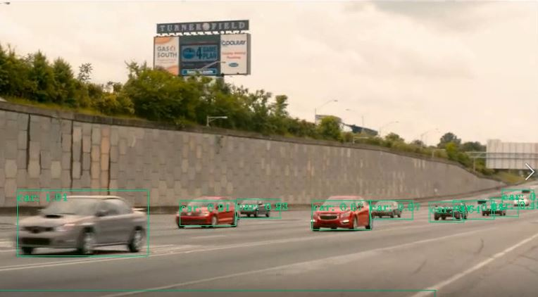

# YOLO-Tensorflow

## Download model & configure file 

https://drive.google.com/drive/folders/1wZ-ZBqkeBU9P6At6FSJsOXE9zW7AK6fI?usp=sharing


## Library version

+ tensorflow-gpu 1.10.0
+ tensorflow 1.2.0
+ CUDA 9.0.176
+ CUDA-DNN 
+ Opencv
+ imgaug (ref : https://github.com/aleju/imgaug)




## Quick start

##### 1. Download this project
##### 2. Download model weight, configure file, label from [here](https://drive.google.com/drive/folders/1wZ-ZBqkeBU9P6At6FSJsOXE9zW7AK6fI?usp=sharing)
##### 3. There are 3 files in google drive. 

###### CNN model files
    
    - [pascal_voc_2017]-416_5.data
    - [pascal_voc_2017]-416_5.index
    - [pascal_voc_2017]-416_5.meta

###### Network configure file
    - pascal_voc_config.json

###### Label:color match file
    - pascal_voc_label

##### 4. Open configure file and setting your path

```python
        "path": {
            "load_model": "./saved_network/[pascal_voc_2017]-416_5",        # writhe your loaded model path
            "save_model" : "./saved_network/[pascal_voc_2017]-416_5",      # this will use when you training
            "TB_logpath": "./",
            "Label_path": "./setting/pascal_voc_label",                     # label file location
            "data_path": "./Data/",                          # this will use when you training
            
            "train_path_f": "",                                             # for fine tunning [not implemented]
            "test_path_f":"",                                               # for fine tunning [not implemented]
            "data_path_f":"",                                               # for fine tunning [not implemented]
            "classfication_dir": "/home/titan/data/"                        # for fine tunning [not implemented]
        },
```

##### 5. Open 'detector_opencv.py' and just run ( you need camera )
```python
    if __name__ == '__main__':
        # Test camera use your cv
        main(0, "./saved_network/[pascal_voc_2017]-416_5")
        # Record detected vedeo
        main(path, "./saved_network/[pascal_voc_2017]-416_5",record=True,record_path="./output.mp4",resolution=(1280, 642))
```

### How to training
You want training new model on your dataset follow behind


##### 1. Check your path of dataset, model_name, Label_path

In configure file you must check load_model, save_model, Label_path, data_path ignore other things

```python
        "path": {
            "load_model": "./saved_network/COCO_max-31",        # load model location
            "save_model" : "./saved_network/pascal_voc_2017",   # saved model location 
            "TB_logpath": "./",
            "Label_path": "./setting/coco_label",               # label file location
            "data_path": "D:/dataset/PASCAL_VOC/",              # image datas location
            "train_path_f": "",
            "test_path_f":"",
            "data_path_f":"",
            "classfication_dir": "/home/titan/data/"            # [not implemented]
        },
```
save_model & load_model use when you save&load model, you just set the path

you set data_path in this directory you have 3type of files

- Image(jpg) file, Label(.txt)file, train.txt file, test.txt file

In data directory

-rw-r--r-- 1 root root  108389 Mar  4  2018 2012_004329.jpg  
-rw-r--r-- 1 root root      53 Mar  4  2018 2012_004329.txt  
-rw-r--r-- 1 root root  131185 Mar  4  2018 2012_004330.jpg  
-rw-r--r-- 1 root root      40 Mar  4  2018 2012_004330.txt  
-rw-r--r-- 1 root root  148030 Mar  4  2018 2012_004331.jpg  
-rw-r--r-- 1 root root      39 Mar  4  2018 2012_004331.txt  
-rw-r--r-- 1 root root   39614 Mar  4  2018 test.txt  
-rw-r--r-- 1 root root  262711 Mar  4  2018 train.txt  

root@user-P10S-WS:/disk1/titans_data/pascal_voc/PASCAL_VOC# cat 2012_004331.txt  
14 0.31 0.34 0.212 0.5466666666666666

Each value means class(like persone or car), center x, center y, width, height in the 2012_044331.jpg file.

root@user-P10S-WS:/disk1/titans_data/pascal_voc/PASCAL_VOC# tail train.txt   
2012_004310  
2012_004312  
2012_004315  
2012_004317  
2012_004319  
2012_004326  
2012_004328  
2012_004329  
2012_004330  

In train.txt file you write your train_datas name except extension

##### 2. Select archtecture you want and use get_anchors.py to get an anchors

you can find model in model/Network/[net name] and change the configure file

```python
"network": {
    "anchor": [[1.0068,1.6871], [2.5020,4.4176], [4.3034,8.7792], [7.8379,5.2096], [10.0773,10.7282]],
    "name": "darknet_full",
    "input_shape" : 416,
    "output_shape" : 13,
    "finetunning" : false
     },
```

get anchor using under command line

    # python3 get_anchors.py -c [configurefile path] -a [# of anchors]

then you can get anchors like this.

[[1.0068,1.6871], [2.5020,4.4176], [4.3034,8.7792], [7.8379,5.2096], [10.0773,10.7282]]

##### 1. Select archtecture you want and use get_anchors.py to get an anchors

### Configure file

```python
    {
        "archtecture": { # Network Archtector check "./model/network"
            "network": {
                "anchor": [[1.0068,1.6871], [2.5020,4.4176], [4.3034,8.7792], [7.8379,5.2096], [10.0773,10.7282]],
                "name": "darknet_full",
                "input_shape" : 416,
                "output_shape" : 13,
                "finetunning" : false
            },
            "net_constant": {
                "coordinate": 1.0,
                "obj": 5.0,
                "noobj": 1.0,
                "probability": 1.0
            },
            "nms_setting":{
                "max_output_size" : 10,                         # number of maximum draw boxs 
                "iou_threshold" : 0.5,                          # iou_threshold
                "score_threshold" : 0.3                         # remove box under score
            }
    
        },
        "option":{                                              # training option
            "tensorboard_use": false,                           # not implemented
            "max_to_keep" : 10,                                 # number of maximum model when you save it
            "batch_size":1,                                     # batch_size wheb you run dectector opencv set batch_size = 1 
            "use_pretrainmodel" : true,                         # when you use pretraining model, set true
            "use_finemodel" : false                             # use_finetunning model [not implemented]
        },
        "training_setting": {                                   # training detection model setting [not implemented]
            "total_epoch": 600,
            "number_class": 80,                                 # number of class
            "lr": 0.001,                                        # learning_rate
            "decrease_rate": 0.99,                              # decrease_rate of learning rate per epoch
        },
        "finetunning_setting": {                                # training classification model setting
            "total_epoch": 10,                                  
            "number_class": 1000,
            "lr": 0.0001,
            "decrease_rate": [ 0.9, 0.95, 0.99],
            "decrease_epoch": [ 20, 40, 60],
            "trdata_nb" : 1281167,
            "tedata_nb" : 0
        },
        "path": {
            "load_model": "./saved_network/COCO_max-31",        # load model location
            "save_model" : "./saved_network/pascal_voc_2017",   # saved model location 
            "TB_logpath": "./",
            "Label_path": "./setting/coco_label",               # label file location
            "data_path": "D:/dataset/PASCAL_VOC/",              # image datas location
            "train_path_f": "",
            "test_path_f":"",
            "data_path_f":"",
            "classfication_dir": "/home/titan/data/"            # [not implemented]
        },
        "augmentation": {                                       # [not implemented]
            "horizen_flip": true,
            "augmentation2": true,
            "augmentation4": true,
            "augmentation3": true
        }
    }
```

### Running sample
detector_opencv.py
parm1 : input_stream  / parm2 : configure file
    
    # Use camera with detect model
    main(0, "./setting/configure.json")
    
    # Read video path with dectec model
    main(path,"./setting/configure.json")
    
    # Record output steam
    main(path, "./setting/configure.json",record=True,record_path="./output.mp4",resolution=(1280, 642))


### How to draw Precision & Recall curve
